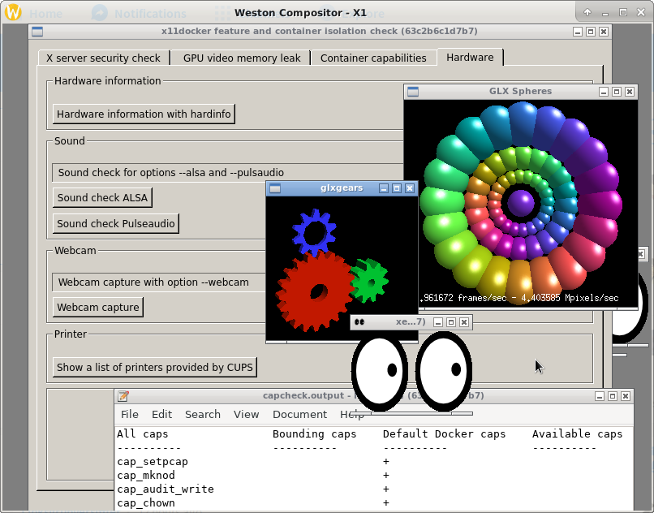
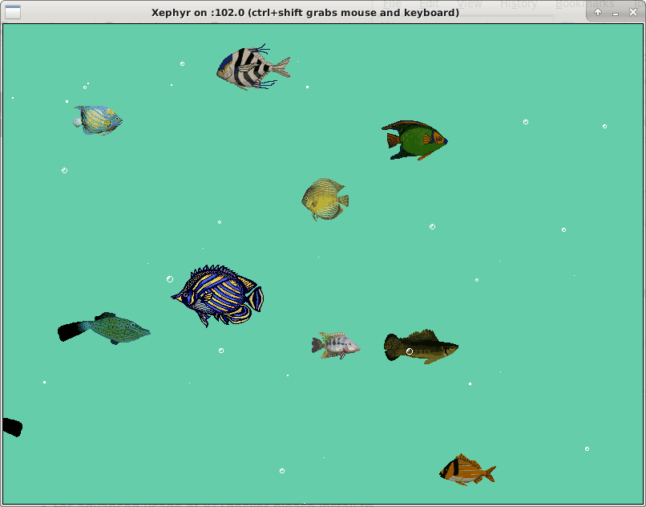
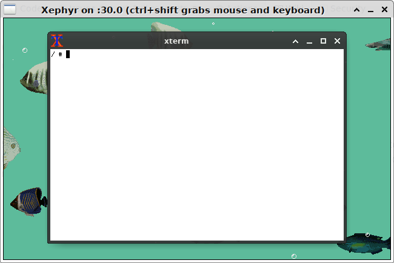

# Screenshots of GUI applications and desktop environments running with x11docker 

`x11docker --desktop --gpu --init=systemd -- x11docker/gnome`

`x11docker --wm --gpu x11docker/check`

`x11docker --desktop x11docker/lxqt`

`x11docker --desktop --gpu --systemd --pulseaudio x11docker/deepin`

`x11docker --desktop --gpu x11docker/plasma`

`x11docker --desktop x11docker/fluxbox`

`x11docker --desktop x11docker/mate`

`x11docker --desktop --runit --gpu x11docker/enlightenment`

`x11docker --desktop --gpu x11docker/trinity`

`x11docker --desktop --gpu --systemd x11docker/cinnamon`

`x11docker --desktop x11docker/xfce`

`x11docker --desktop x11docker/lxde`

`x11docker --desktop x11docker/xfce-wine-playonlinux`

`x11docker --desktop x11docker/lxde-wine`

`x11docker --desktop x11docker/lumina`

`x11docker --wayland --gpu x11docker/xwayland`

`x11docker --xfishtank`

`x11docker jess/cathode`

`x11docker --desktop --size 320x240 x11docker/lxde`

`x11docker x11docker/lxde-wine xterm`

[Interactive xterm during `docker build`](https://github.com/mviereck/x11docker/wiki/docker-build-with-interactive-GUI)

