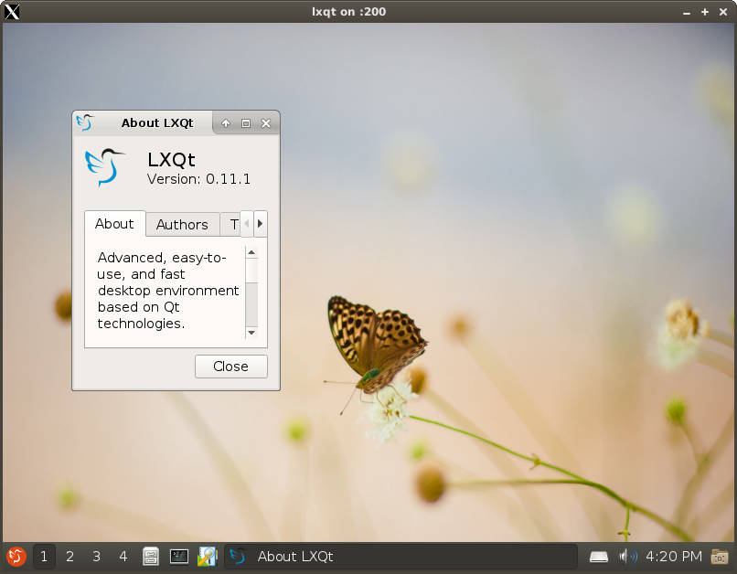
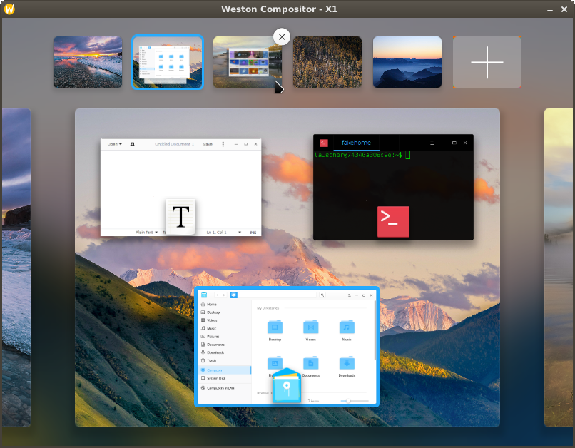
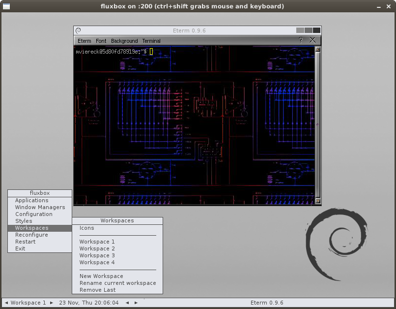
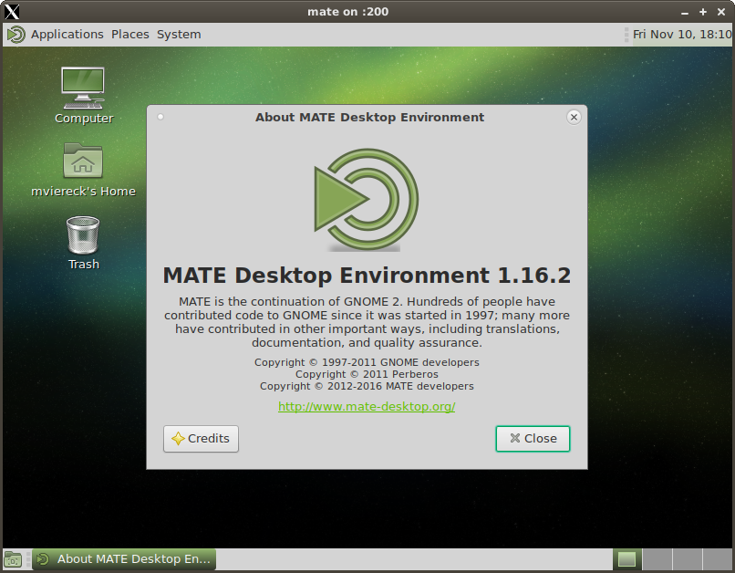
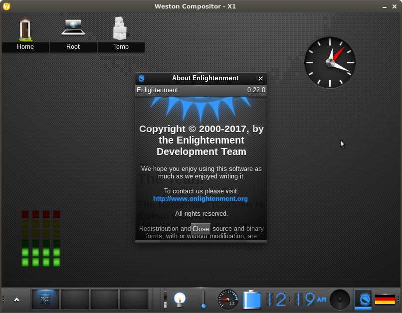
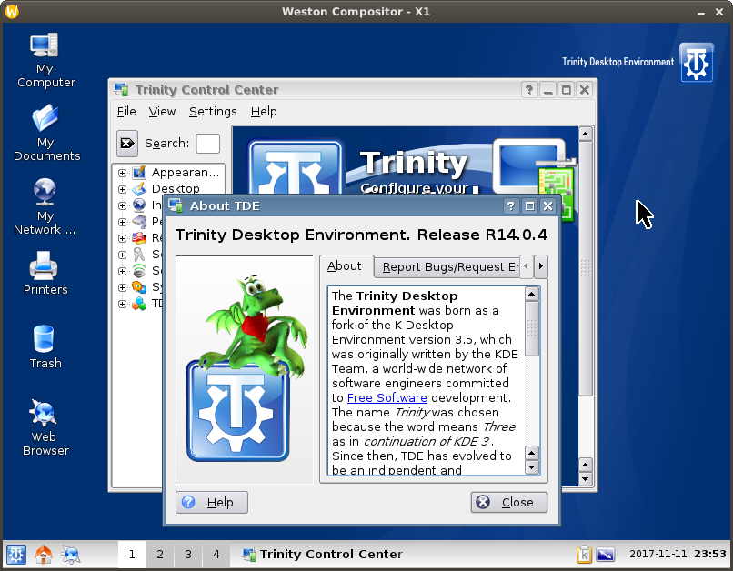
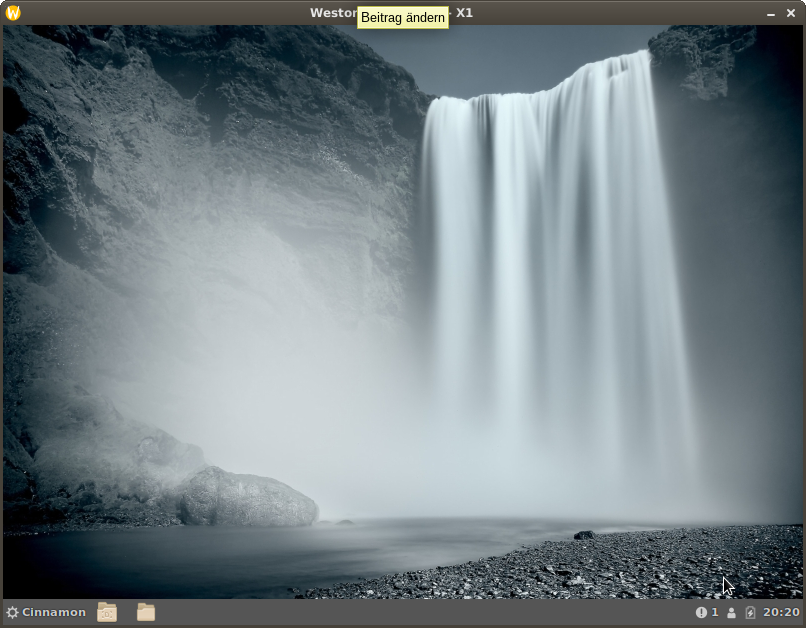
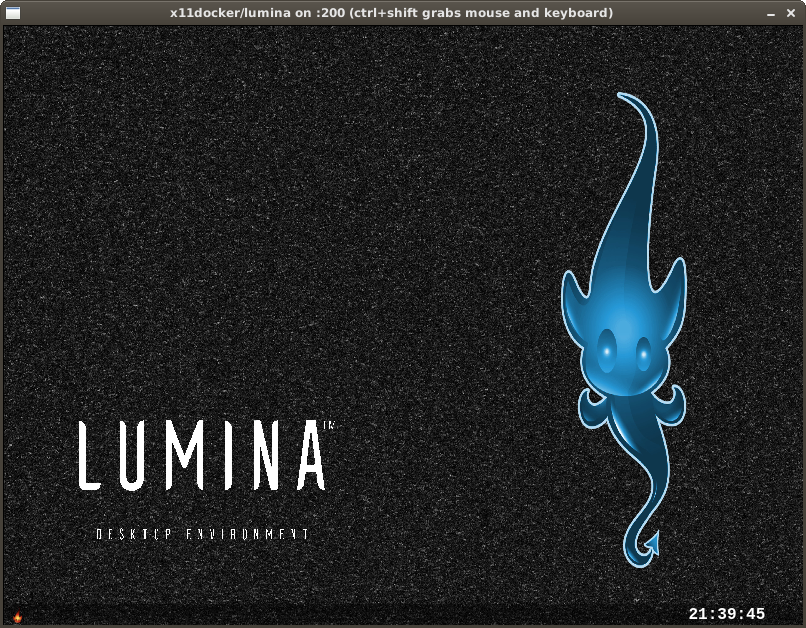
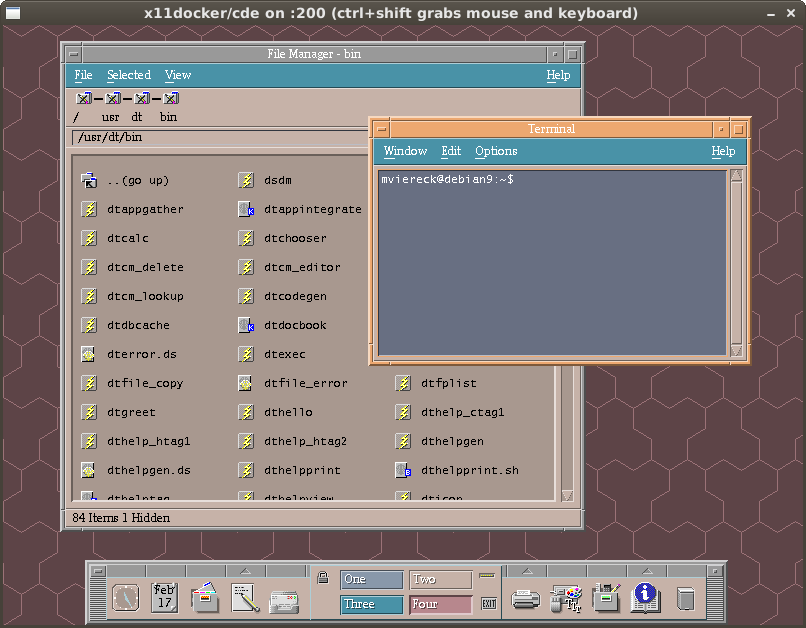
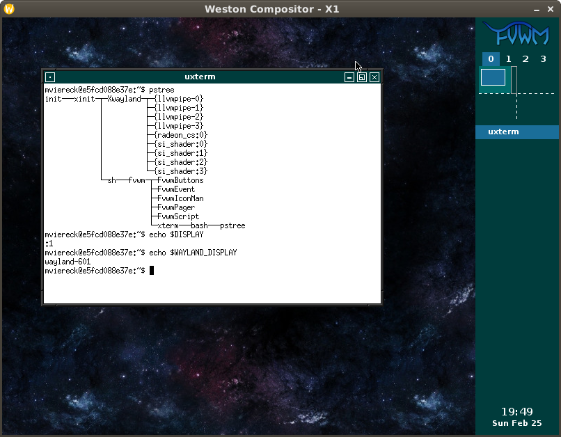

# Screenshots of GUI applications and desktop environments running with x11docker 

 

`x11docker --desktop x11docker/lxqt`

`x11docker --desktop --gpu --systemd --pulseaudio x11docker/deepin`

`x11docker --desktop --gpu x11docker/plasma`

`x11docker --desktop x11docker/fluxbox`

`x11docker --desktop x11docker/mate`

`x11docker --desktop --runit --gpu x11docker/enlightenment`

`x11docker --desktop --gpu x11docker/trinity`

`x11docker --desktop --gpu --systemd x11docker/cinnamon`

`x11docker --desktop x11docker/xfce`

`x11docker --desktop x11docker/lxde`

`x11docker --desktop x11docker/xfce-wine-playonlinux`

`x11docker --desktop x11docker/lxde-wine`

`x11docker --desktop x11docker/lumina`

`x11docker --desktop --net x11docker/cde`

`x11docker --wayland --gpu x11docker/xwayland`

`x11docker jess/cathode`

`x11docker --desktop --size 320x240 x11docker/lxde`

`x11docker x11docker/lxde-wine xterm`

# x11docker-gui

